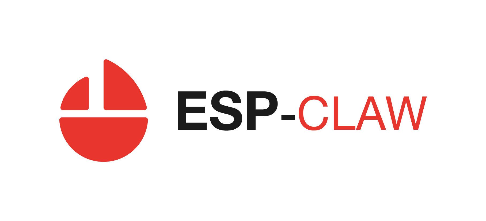
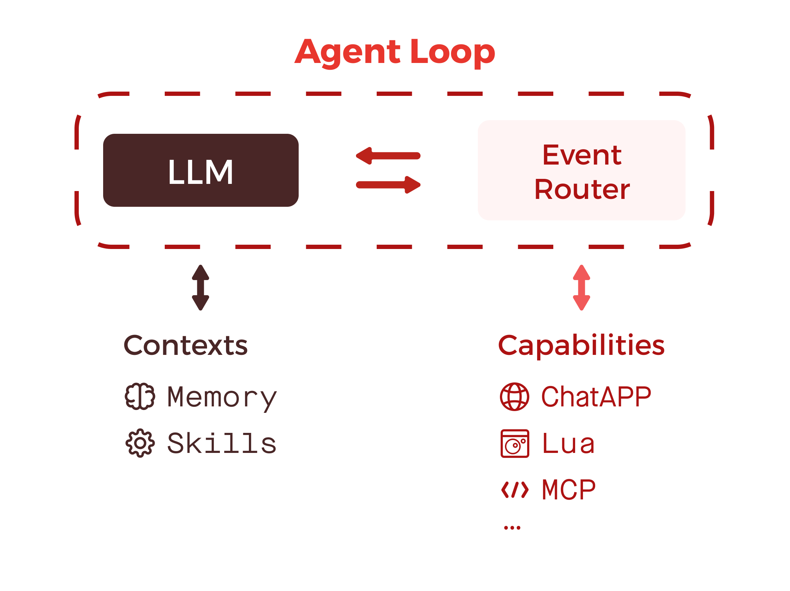
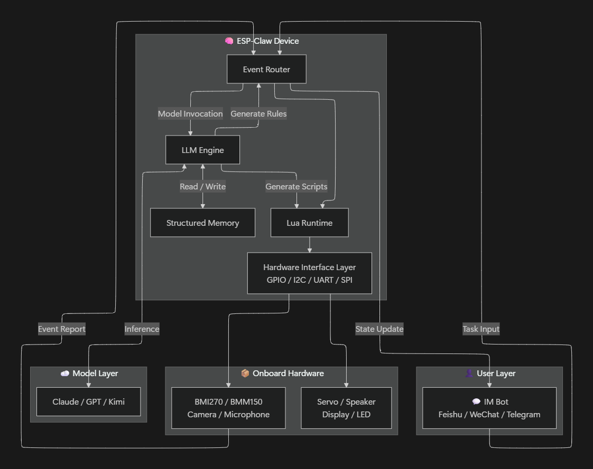
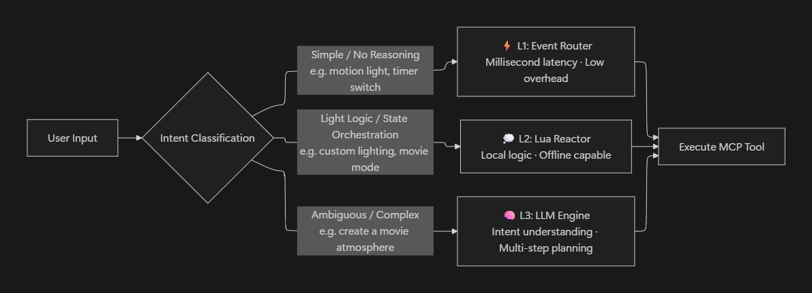
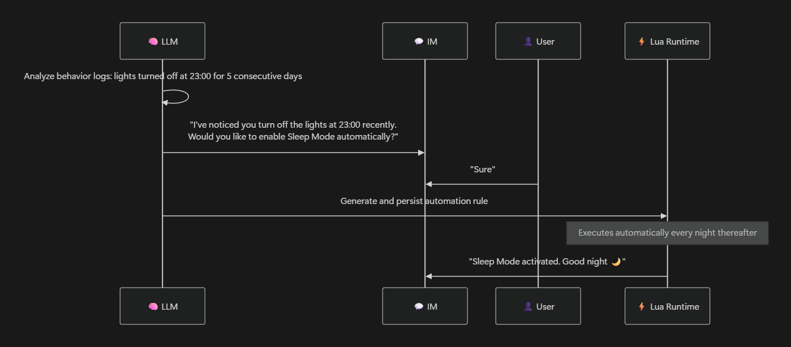

# ESP-Claw: An AI Agent Framework for IoT Devices

  <a href="./README.md">English</a> |
  <a href="./README_CN.md">中文</a> |
  <a href="./README_JP.md">日本語</a>

ESP-Claw is an AI agent framework purpose-built for IoT devices. Inspired by OpenClaw and redesigned for AIoT, it brings four key capabilities to the edge:

- **Event-driven runtime:** Any event can trigger the Agent Loop or other actions, not just user messages
- **Lua runtime:** Lets the LLM plan, refine, and hand off executable logic
- **Structured memory management:** Keeps memory organized, persistent, and useful over time
- **MCP and MCP bridging:** Connects both native MCP devices and traditional IoT hardware

## OpenClaw to ESP-Claw: From a Digital Brain to a Physical Agent

PCs excel at software-heavy workflows and internet-native tasks. Embedded devices, by contrast, live much closer to the physical world. Their job is to **sense, process, communicate, and act**.

That is why moving the agent runtime from a PC or server onto an MCU is more than a deployment change. It is a shift in purpose.

ESP-Claw is designed for embedded-side agent workloads. It brings an **LLM brain** for reasoning and decisions into a physical device, then pairs it with a **Lua cerebellum** for deterministic execution, **event reflexes** for real-time response, **MCP tentacles** for sensing and actuation, and a **structured memory vault** for long-term context. The result is an agent that is both responsive and capable.

| **Dimension** | **OpenClaw (PC/Server)** | **ESP-Claw (Embedded AIoT)** |
| --- | --- | --- |
| **Core scenario** | Software automation and digital task orchestration | Physical-world sensing, decision-making, communication, and control |
| **Processing logic** | User request -> return result | External event -> execute action |
| **Execution engine** | LLM-driven | Three-tier event handling: LLM + Lua + Router |
| **Memory management** | Basic conversation context + long-term memory | Structured long-term memory engine (JSONL + summary tags) |
| **Device protocol** | MCP Client | MCP as a unified language + multi-protocol bridging |
| **Power consumption** | Tens of watts | 0.5 W, USB-powered 24/7 |
| **Security** | Root/shell available, larger attack surface | No shell, no root, minimal attack surface |

## Traditional AIoT vs. ESP-Claw: From Cloud-Centric to Edge-Native AI

ESP-Claw uses a chat-first interaction model. Users can switch model providers freely, and devices do not depend on a standalone app, a proprietary vendor cloud, or a closed ecosystem.

| **Dimension** | **Traditional Model (Cloud-Centric)** | **ESP-Claw (Edge AI)** |
| --- | --- | --- |
| **Control center** | Cloud server | Edge node (ESP chip) |
| **UI carrier** | Standalone app / control panel | IM chat (Feishu / WeChat / Telegram) |
| **Inter-device communication** | Proprietary SDK / MQTT / Matter | MCP (unified Tool / Resource interface) |
| **Interaction logic** | Preset automation (If-This-Then-That) | LLM intent understanding + autonomous decision-making |
| **Extensibility** | High barrier to plugin development, closed ecosystem | Plug-and-play MCP Tools, community-driven expansion |
| **Privacy** | Data uploaded to the cloud | All data stays local |
| **Offline impact** | Intelligent features stop working | Local Lua rules and memory continue to run |
| **Model binding** | Tied to a vendor AI service | Users can switch providers freely (Claude / GPT / Kimi) |

ESP-Claw follows a local-first memory architecture where **the device itself becomes the data center**. Personal routines, schedules, and household context remain on-device, bringing the risk of **privacy leakage** close to zero. More importantly, memory is not treated as a passive log. It becomes a system that can **learn from behavior**.

ESP-Claw also brings Lua scripting into AIoT, challenging the old idea that hardware customization is only for experienced makers. With dynamic Lua loading and IM-based interaction, **ordinary users can shape device behavior as naturally as they chat**. Users buy hardware once, then define the software experience themselves. In that sense, every ESP-Claw device becomes a programmable canvas.

## Multiple Deployment Forms: Standalone Devices and Multi-Device Gateways

ESP-Claw can run in both **standalone smart devices** and **multi-device gateways**. Both share the same core agent stack, including the LLM thinker, Lua runtime, event scheduler, and structured memory vault. The difference lies in scope: standalone devices orchestrate onboard peripherals directly through GPIO/I2C, while gateways coordinate multiple devices through BLE discovery, a Shadow Server, and an event bus.

| **Dimension** | **Standalone Smart Device** | **Multi-Device Gateway** |
| --- | --- | --- |
| **Hardware** | ESP32-C series + onboard sensors/actuators | ESP32-P4 + C5 (flagship) / ESP32-S3 (lightweight) |
| **Core responsibility** | Control onboard peripherals and complete the sense-decide-act loop | Manage multiple external IoT devices and unify heterogeneous protocols into MCP Tools |
| **Device discovery** | Not required, peripherals are fixed on board (GPIO/I2C/SPI) | BLE ADV scanning + mDNS + Manifest parsing |
| **Protocol/interface** | Lua calls hardware interfaces directly, no translation needed | Shadow Server generates virtual MCP Tools for legacy devices |
| **Event model** | Peripheral interrupts / sensor callbacks -> Lua events | Local event bus (L1 immediate + L2 computed + L3 semantic) |
| **Typical scenarios** | AI desktop companion, security sentry, chat-based programming | Smart home, building energy management, Zigbee integration |
| **Shared core** | LLM thinker + Lua runtime + event scheduling + structured memory vault + IM interaction + local-first privacy | LLM thinker (L3) + Lua runtime (L2) + event scheduling (L1) + structured memory vault + IM chat interface |

**Standalone device architecture:**

**Multi-device gateway architecture:**

<!-- TODO: Replace with gateway architecture diagram -->

---

## Technical Overview

The ESP-Claw stack spans five layers, from user-facing applications down to the hardware platform:

| **Layer** | **Responsibility** | **Key components** |
| --- | --- | --- |
| Application layer | User-facing entry points | IM bot, MCP Client, plugin store, debug terminal |
| Interaction layer | Message exchange and transport | Webhook, SSE event push, MCP JSON-RPC, token management |
| Service and framework layer | Decision-making, execution, memory, device abstraction | AI subsystem, event subsystem, Lua subsystem, memory subsystem, protocol subsystem |
| Kernel layer | Real-time runtime infrastructure | FreeRTOS, lwIP/TLS, peripheral drivers, FatFS |
| Hardware layer | Chip platform and physical peripherals | ESP32-P4, C5, S3, C3/C2, sensors, actuators |

At the heart of ESP-Claw is the service and framework layer. This is where reasoning, execution, memory, and device abstraction come together.

### LLM + Lua + Event Router: Intelligence with Determinism

In IoT scenarios, actions such as smoke alarm linkage or shutting off a gas valve **must happen quickly and exactly as intended**. A purely LLM-driven system is powerful, but it is also non-deterministic and not ideal for hard real-time response. The same instruction may lead to different outcomes under different models or parameters. **That is exactly why ESP-Claw combines an event router with Lua.**

ESP-Claw uses a three-level execution model:

|  | **L1: Event Router** | **L2: Lua Runtime** | **L3: LLM Thinker** |
| --- | --- | --- | --- |
| **Role** | Deterministic events with no reasoning required | Local analysis and handlers | Non-deterministic reasoning engine |
| **Latency / reproducibility** | Millisecond-level, 100% deterministic | Millisecond-level, 100% deterministic | Second-level, depends on model behavior |
| **Offline / token usage** | Fully offline, no token cost | Fully offline, no token cost | Requires network, consumes tokens as needed |

**Core mechanism - distilling L3 output into L2/L1 rules:** The key idea behind hierarchical event handling is that non-deterministic LLM output can, after user confirmation, be **solidified into deterministic, real-time rules and programs**. For example, if the LLM notices that a user turns off the lights at 23:00 for three nights in a row, it can suggest creating a Lua schedule rule. Once accepted, that rule runs directly at 23:00 every night without going through LLM inference again. Even if the model provider changes later, the accumulated behavior remains intact.

**Dynamic Lua loading** makes the device feel alive. New logic can be applied immediately without reflashing firmware. The firmware keeps the skeleton stable, while Lua allows the device behavior to evolve quickly. Scripts can also be pushed remotely, so device capabilities can be updated without physical access.

### MCP as a Unified Protocol: Making Every Device an AI-Native Tool

MCP (Model Context Protocol) is the common device language inside ESP-Claw. The gateway hides protocol differences from the agent, so what the agent sees is always a clean, standardized list of MCP Tools.

**Device onboarding happens in three steps:**

1. **Discovery** - After power-on, the device broadcasts its capabilities over BLE ADV without requiring a connection. Wi-Fi devices can complement this with mDNS, and the gateway passively detects them.
2. **Registration** - The gateway fetches the built-in JSON Manifest, automatically generates MCP Tools, and registers them in the tool list. OTA upgrades refresh the registration incrementally.
3. **Execution** - The AI invokes standard MCP Tool Calls. After execution, the device updates its ADV broadcast within 10 ms, the gateway captures the new state, and pushes it to the agent over SSE, with an end-to-end latency of roughly 50-220 ms.

**Compatibility with existing devices:** For legacy devices that do not support MCP, such as Zigbee or Thread hardware, the gateway mounts an internal **Shadow Server** as a virtual MCP Server and uses Lua drivers for protocol translation. Supporting a new protocol only requires implementing and registering the standard `device_driver_t` interface. The core architecture remains unchanged.

**AI-native semantics:** Tool names use a verb-noun pattern such as `turn_on` and `get_temperature`, while return values carry metadata such as units and freshness. This lets the AI understand and invoke tools without relying on external documentation. Once all devices are exposed through the same MCP abstraction, the agent can compose tools across devices and unlock **emergent multi-step behavior**.

### Local Memory System: From Session Memory to Long-Term Understanding

Most AI agents are limited to the conversation window. Once the session ends, the memory is gone. ESP-Claw instead provides a full **structured long-term memory system** that runs locally on the device.

**Five memory types:** User profile (`profile`), user preferences (`preference`), factual knowledge (`fact`), device events (`event`), and behavioral rules (`rule`)

**Lightweight retrieval:** Instead of depending on a vector database, ESP-Claw uses **summary tags**. Each memory item is attached to one to three keywords. At retrieval time, the system injects the tag pool so the LLM can recall the relevant content on demand. This keeps memory lookup efficient even within MCU constraints.

**Continuous evolution:** Memory grows through conversation extraction, event archiving, and behavior-to-rule refinement. More importantly, the LLM can detect recurring patterns and **proactively suggest new automation rules**.

> **Privacy and data sovereignty:** All memory data is stored locally on the device in plain-text formats such as JSONL and Markdown. It is never uploaded to the cloud. Users can inspect, edit, or delete it at any time. Your device is your data center.

---

## Use Cases

Users describe what they want in natural language. The LLM interprets the intent, coordinates sensors, screens, speakers, and servos, generates Lua scripts, and deploys them to the device for immediate execution. **Hardware is deployed once, but functionality can keep evolving. The user is not just operating the device, but defining what it can become.**

### Smart Home AI Assistant

Imagine BLE temperature and humidity sensors working together with Wi-Fi smart lights. The user expresses an intent in natural language, the agent reads sensor data directly from the ADV cache without opening a BLE connection, and then controls the lights over Wi-Fi. No app, no account system, no cloud dependency. Everything runs locally.

### AI Desktop Companion

A single ESP32-S3 with a screen, camera, BMI270 (accelerometer/gyroscope), BMM150 (magnetometer), microphone, speaker, and servo can become a desktop companion with a body, eyes, ears, a voice, facial expression, and an AI brain:

- **A growing AI toy** -> Builds its own personality and memory as it grows with the user
- **"Make me a shake-to-answer magic book"** -> Detects BMI270 shake events -> shows a random quote on screen + plays a short melody
- **"I want a meeting guardian"** -> Detects sustained speech and starts timing -> if the meeting runs long, the screen expression shifts from focused to exhausted -> in extreme cases it proactively sends a rescue message
- **"Build an anti-procrastination coach"** -> Starts a focus countdown -> detects when the user leaves the seat or gets distracted by the phone -> escalates reminders step by step
- **"Turn into a smart sentry"** -> Wakes on BMI270 motion detection -> captures an image -> uses AI to assess danger level -> escalates audio warnings -> sends a report through chat

### Plant and Pet Care

- **Pet feeder:** Supports scheduled feeding or remote feeding through chat, monitors food level with sensors, and sends reminders proactively
- **Plant watering:** Uses soil-moisture sensors and a relay-driven pump, while the LLM adjusts the watering strategy dynamically based on season and weather

### More Scenarios

Relay control, music players, environmental monitoring, data visualization, and more. The full demo catalog covers 50+ scenarios across ten categories, including posture interaction, magnetometer-based interaction, audio processing, visual AI, multi-sensor fusion, timed automation, entertainment, and data visualization.

## How to Deploy and Use

### Ready Out of the Box

Setup and downloads are handled through a web interface. There is no need to compile firmware or install additional software just to flash and get started.

Thanks to the modular architecture of ESP-BoardManager, the project can be adapted easily across different board-level configurations.

### Build from Source

[Basic_demo](./application/basic_demo) provides a foundational example for development and testing. For build and flashing details, please refer to its [README](./application/basic_demo/README.md).

### Notes

- The project is still under active development. If you run into issues, feel free to open an issue.
- Features such as self-programming depend on strong reasoning models. GPT-5.4 or a model with similar capability is recommended for the best experience.

## Follow Us

If this project helps or inspires you, a star would mean a lot.

Community support is what keeps the project moving forward.

## Acknowledgements

ESP-Claw is inspired by [OpenClaw](https://github.com/openclaw/openclaw).

Its implementation of Agent Loop and IM communication on embedded devices was also informed by [MimiClaw](https://github.com/memovai/mimiclaw).

MimiClaw also helped demonstrate the feasibility of running OpenClaw-style agent workflows on ESP32-S3.
