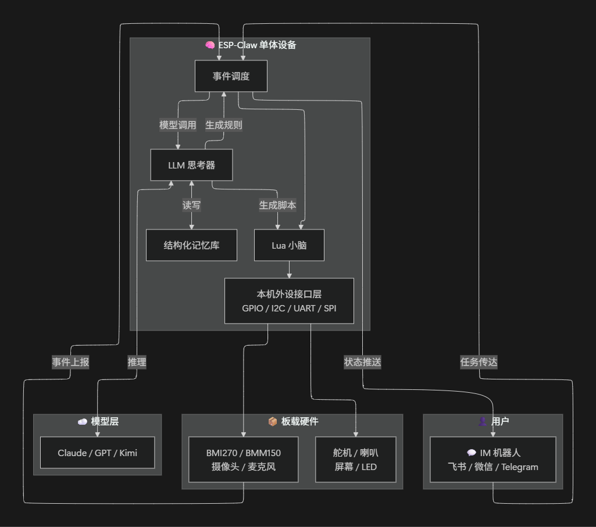
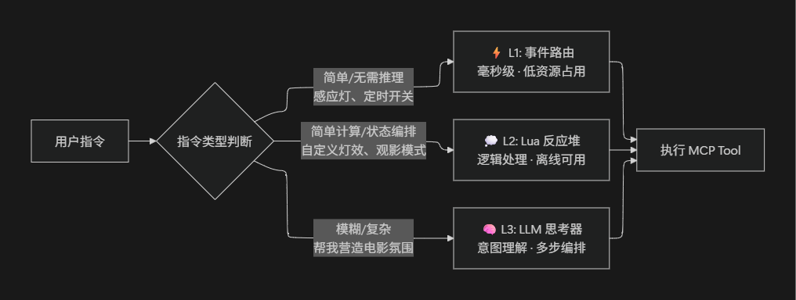
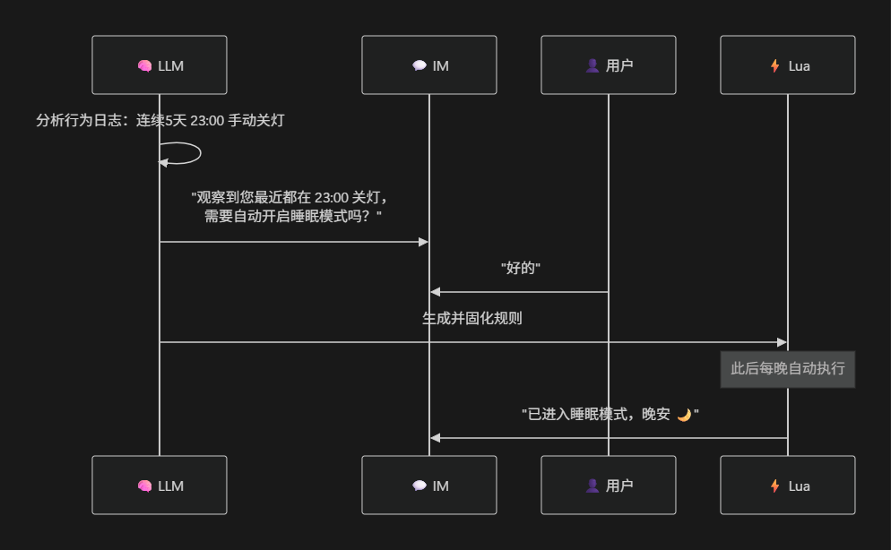

# ESP-Claw ：物联网设备 AI 智能体框架

  <a href="./README.md">English</a> |
  <a href="./README_CN.md">中文</a> |
  <a href="./README_JP.md">日本語</a>

ESP-Claw 是专为物联网设备量身定制的 AI 智能体框架，面向 AIoT 场景在 OpenClaw 理念的基础上进行了四项核心增强：

- **事件驱动：**  可任意事件触发 Agent Loop 和其它动作，而不只是用户消息
- **Lua 运行时：** 由 LLM 主动规划功能
- **结构化记忆管理：** 有条理的沉淀记忆内容
- **MCP & MCP 桥接：** 支持标准 MCP 设备与传统 IoT 设备接入

## OpenClaw 到 ESP-Claw：从数字大脑到物理智能体

PC 主要用于处理复杂的软件任务与互联网交互，而嵌入式设备更专注于物理世界的 **信息搜集、处理、传达与执行** 。因此将 Agent Runtime 从 PC/服务器迁移到 MCU 侧不仅是设备性质发生了变化，更多的是 **任务目标** 的转变。

ESP-Claw 是一套适用于处理嵌入式设备侧任务的 AI 智能体框架，使嵌入式设备也能够真正发挥 AI 智能体的能力。为此，ESP-Claw 将 **LLM 大脑**（思考与决策）部署到实体物理设备中，并为其搭配 **Lua 小脑**（确定任务执行）、**事件反射神经**（实时响应）、**MCP 触角**（感知与执行）和 **结构化记忆库**，使其又快又聪明。

| **维度** | **OpenClaw（PC/服务器）** | **ESP-Claw（嵌入式 AIoT）** |
| --- | --- | --- |
| **核心场景** | 软件自动化、数字任务编排 | 物理世界感知、决策、传递与控制 |
| **处理逻辑** | 用户需求→返回结果 | 外部事件→执行动作 |
| **执行引擎** | LLM 驱动 | 三级事件处理：LLM + Lua + Router（确定性 + 智能） |
| **记忆管理** | 基础会话上下文 + 长期记忆 | 结构化长期记忆引擎（JSONL + 摘要标签） |
| **设备协议** | MCP Client | MCP 统一语言 + 多协议桥接 |
| **功耗** | 数十瓦 | 0.5W，USB 供电 24/7 |
| **安全性** | 有 root / shell，攻击面大 | 无 shell、无 root，攻击面极小 |

## 传统 AIoT vs ESP-Claw：从云中心化到边缘 AI 化

ESP-Claw 采用 "C2C 聊天式" 交互，用户可自由切换模型供应商，设备不依赖独立 App、不依赖封闭的厂商云服务器，不依赖于任何单一平台生态。

| **维度** | **传统模式（云中心化）** | **ESP-Claw（边缘 AI 化）** |
| --- | --- | --- |
| **控制中心** | 云端服务器 | 边缘节点（ESP 芯片） |
| **UI 载体** | 独立 App / 屏幕面板 | IM 聊天（飞书 / 微信 / Telegram） |
| **设备间通讯** | 私有 SDK / MQTT / Matter | MCP（统一 Tool / Resource 接口） |
| **交互逻辑** | 预设自动化（If-This-Then-That） | LLM 意图理解 + 自主决策 |
| **扩展性** | 插件开发门槛高，生态封闭 | MCP Tool 即插即用，社区共建 |
| **隐私保障** | 数据上传云端 | 数据全部留在本地 |
| **断网影响** | 失去所有智能功能 | 本地 Lua 规则 + 记忆照常运行 |
| **模型绑定** | 绑定厂商私有 AI 服务 | 用户自由切换模型供应商（Claude/GPT/Kimi） |

ESP-Claw 采用本地记忆体系，**设备就是数据中心**。生活习惯、作息规律、家庭成员信息等私密的数据均保存于本地，**隐私泄露风险**趋近于零。并且记忆体系不只是一个被动的数据记录器，而是一个能够**从行为中学习**的智能体。

ESP-Claw 将 Lua 脚本引擎引入 AIoT，改变过去硬件 DIY 只适合有编程能力的 Maker 群体的局面。借助 Lua 动态加载 + IM 聊天交互，**普通用户也能像聊天一样定义自己的设备行为。** 用户买到的是一个硬件，但软件功能由自己定义——就像早期手机用户通过刷机实现不同功能和系统，ESP-Claw 让每个智能设备都成为用户手中的“可编程画布”。

## 多种部署形态：单体设备与多设备网关

ESP-Claw 可以部署在**单体智能设备**和**多设备网关**中。两种形态共享同一套 Agent 内核（LLM 思考器 + Lua 小脑 + 事件调度 + 结构化记忆库），区别在于单体设备面向本机外设调度（GPIO/I2C 直接控制板载传感器与执行器），网关面向多设备编排（BLE 发现 + Shadow Server + 事件总线）。

| **维度** | **单体智能设备** | **多设备网关** |
| --- | --- | --- |
| **硬件** | ESP32-C 系列 + 板载传感器/执行器 | ESP32-P4 + C5（旗舰）/ ESP32-S3（轻量） |
| **核心职责** | 调度本机板载外设，感知-决策-执行闭环 | 管理多个外部 IoT 设备，将异构协议统一为 MCP Tool |
| **设备发现** | 无需发现，外设固定在板（GPIO/I2C/SPI） | BLE ADV 扫描 + mDNS + Manifest 解析 |
| **协议/接口** | Lua 直接调用硬件接口，无需转译 | Shadow Server 为 Legacy 设备生成虚拟 MCP Tool |
| **事件模型** | 外设中断/传感器回调 → Lua 事件 | 本地事件总线（L1 即时 + L2 计算 + L3 语义） |
| **典型场景** | AI 桌面伴侣、安防哨兵、聊天式编程 | 智能家居、楼宇能耗、Zigbee 接入 |
| **共享内核** | LLM 思考器 + Lua 小脑 + 事件调度 + 结构化记忆库 + IM 交互 + 隐私本地化 | LLM 思考器（L3） + Lua 小脑（L2） + 事件调度（L1） + 结构化记忆库 + IM 聊天接口 |

**单体智能设备架构：**

**多设备网关架构：**

//TODO: 请博哥检查这张图

---

## 技术解析

ESP-Claw 的系统栈从应用层到硬件层共五层，以下架构图展示了完整的分层视图：

| **层级** | **职责** | **关键组件** |
| --- | --- | --- |
| 🟢 **应用层** | 用户触达入口 | IM 机器人 · MCP Client · 插件商店 · 调试终端 |
| 🔵 **交互层** | 消息收发与传输 | Webhook · SSE 事件推送 · MCP JSON-RPC · Token 管理 |
| 🟣 **服务与框架层** | 决策·执行·记忆·设备抽象 | AI 子系统 · 事件子系统 · Lua 子系统 · 记忆子系统 · 协议子系统 |
| 🟠 **内核层** | 实时运行时基础设施 | FreeRTOS · lwIP/TLS · 外设驱动 · FatFS |
| 🔴 **硬件层** | 芯片平台与物理外设 | ESP32-P4 · C5 · S3 · C3/C2 · 传感器/执行器 |

其中，服务与框架层是整个系统的核心中枢，包含四大子系统。以下重点解析。

### LLM + Lua + **事件路由**：兼顾智能与确定性

在 IoT 场景中，烟雾报警联动、燃气阀门关闭等操作**必须快速 100% 按预期执行**。但纯 LLM 驱动的系统天然存在响应实时性问题，且具有不确定性——同一条指令在不同模型、不同参数下可能产出不同路径。**事件路由与 Lua 正是为解决这一确定性问题而存在的。**

ESP-Claw 采用 LLM + Lua + 事件路由协同：

|  | **L1：事件路由** | **L2：Lua 小脑** | **L3：LLM 思考器** |
| --- | --- | --- | --- |
| **本质** | 确定、无需推理的事件 | 本地分析与处理器 | 非确定性推理引擎（"大脑决策"） |
| **响应 / 可复现** | 毫秒级 · ✅ 100% 确定 | 毫秒级 · ✅ 100% 确定 | 秒级 · ❌ 因模型而异 |
| **断网 / Token** | ✅ 完全离线 · 无消耗 | ✅ 完全离线 · 无消耗 | ❌ 需网络 · 按需消耗 |

**核心机制 —— L3 → L2/L1 规则沉淀：** 分级事件处理的精髓在于 LLM 的不确定性、非实时输出，经用户确认后**固化为程序与规则的确定性和实时性行为**。例如，LLM 观察到用户连续三天 23:00 手动关灯，便自动建议生成 Lua 定时规则。此后每晚 23:00 由事件路由直接执行，不再经过 LLM 推理——即使更换模型供应商，已沉淀的规则也不受影响。

**Lua 动态加载**进一步让硬件"活"起来——新逻辑写好即刻生效，无需重烧固件；底层固件负责"骨架"保持稳定，Lua 负责"灵魂"快速迭代；支持远程推送脚本，用户无需物理接触设备即可升级功能。

### MCP 统一协议：让每个设备成为 AI 原生工具

MCP（Model Context Protocol）是 ESP-Claw 的统一设备语言。网关的核心职责是对上层 Agent **屏蔽全部协议差异**，Agent 所见的始终是标准化的 MCP Tool 列表。

**设备接入三步链路：**

1. **发现** — 设备上电后通过 BLE ADV 零连接广播能力信息（WiFi 设备通过 mDNS 补充），网关被动捕获即完成识别
2. **注册** — 网关拉取设备自带的 JSON Manifest，自动生成 MCP Tool 并注册到 Tool 列表，OTA 升级后增量刷新
3. **执行** — AI 通过标准 MCP Tool Call 下发指令；设备执行后 10ms 内更新 ADV 广播，网关捕获状态变更通过 SSE 推送 Agent，端到端 50–220ms

**兼容存量设备：** 对不支持 MCP 的 Legacy 设备（Zigbee/Thread），网关内部为其挂载 **Shadow Server**（虚拟 MCP Server），通过 Lua 驱动完成协议转译——新增协议只需实现标准 `device_driver_t` 接口并注册，核心模块不变。

**AI 原生语义接口：** 工具命名采用动词-名词结构（`turn_on`、`get_temperature`），返回值携带单位与新鲜度元信息，AI 无需外部文档即可理解和调用。当所有设备以统一 MCP Tool 形式存在，AI 可跨设备多步编排，产生**工具组合的涌现能力**。

### 本地记忆系统：从"用完即忘"到"越用越懂你"

传统 AI Agent 的记忆局限于对话窗口，会话结束即遗忘。ESP-Claw 在设备本地实现了完整的**结构化长期记忆系统**：

**五类记忆：** 用户资料（`profile`）· 用户偏好（`preference`）· 事实知识（`fact`）· 设备事件（`event`）· 行为规则（`rule`）

**轻量级检索：** 不依赖向量数据库，而采用**摘要标签**机制——每条记忆附带 1-3 个关键词标签，请求时系统注入标签池供 LLM 按需召回正文，在 MCU 有限资源下实现高效检索。

**自动进化：** 系统通过对话抽取、事件归档、行为规则沉淀三条链路持续积累记忆。更关键的是，LLM 能从中发现规律，**主动建议自动化规则**。

> **隐私与数据主权：** 所有记忆数据以纯文本格式（JSONL / Markdown）存储在设备本地，绝不上传云端。用户随时可查看、修改甚至删除——你的设备就是你的数据中心。

---

## 应用场景

用户用自然语言描述“我想要什么”，LLM 理解后自动编排多传感器 + 屏幕 + 声音 + 舵机的协同逻辑，生成 Lua 脚本并下发到设备，即刻运行。**硬件一次部署，功能无限进化——用户不是硬件使用者，而是功能定义者。**

### 智能家居 AI 助理

BLE 温湿度传感器 + WiFi 智能灯。用户通过自然语言向 Agent 表达意图，Agent 从 ADV 缓存读取传感器数据（零 BLE 连接），通过 WiFi 控制灯光。无 App、无账号、无云依赖，局域网内完整运行。

### AI 桌面伴侣

单台 ESP32-S3 搭载屏幕、摄像头、BMI270（加速度/陀螺仪）、BMM150（磁力计）、麦克风、喇叭、舵机。它可以是一个有“身体”（舵机）、有“眼睛”（摄像头）、有“耳朵”（麦克风）、有“嘴”（喇叭）、有“表情”（屏幕）、有“大脑”（AI Agent）的桌面伙伴：
- **成长型 AI 玩具** → 有自己的性格和记忆，陪伴用户成长
- **“帮我做个摇一摇答案之书”** → 检测 BMI270 摇晃事件 → 屏幕随机显示名言 + 播放短旋律
- **“我要一个会议守护者”** → 检测持续人声后开始计时，超时后屏幕表情从“认真”变“煎熬”，严重超时主动发消息当“救场借口”
- **“做个拖延症克星”** → 设定专注任务倒计时，检测到离开座位或刷手机时逐级警告
- **“变成智能哨兵”** → BMI270 运动检测唤醒 → 摄像头拍照 → AI 判断危险等级 → 声音警告逐级升级 → 报告发送聊天

### 植物/宠物看护

- **宠物喂食器：** 定时或远程聊天触发投喂，传感器监测余量并主动提醒
- **植物浇灌：** 土壤湿度传感器联动继电器控制水泵，LLM 根据天气与季节动态调整浇灌策略

### 更多场景

继电器控制、音乐播放器、环境监测、数据可视化等——完整 Demo 列表涵盖姿态交互、磁力计创意、音频处理、视觉 AI、多传感器融合、定时自动化、互动娱乐、数据可视化等十大类 50+ 场景。

## 如何部署使用

### 开箱即用

通过网页进行配置与下载，无需额外编译固件或安装任何软件，即可完成烧录和下载。
依托 ESP-BoardManager 的模块化架构，可轻松适配和切换多种用户板级配置。

### 通过源码编译

[Basic_demo](./application/basic_demo) 提供了基础的测试示例。关于编译与烧录的详细说明，请参考 [README](./application/basic_demo/README.md)。

### 注意事项

- 现在项目仍处于开发阶段，如果遇到问题，随时提交 issue
- 自编程等功能依赖高推理模型的能力，推荐选用 GPT-5.4 或类似性能模型以取得最佳体验。

## 关注我们

如果这个项目对您有所启发和帮助，欢迎点亮一颗星！⭐⭐⭐⭐⭐

您的支持永远是我们更新的最大动力！

## 致谢

灵感来自 [OpenClaw](https://github.com/openclaw/openclaw)。

Agent Loop 和 IM 通讯等功能在嵌入式设备中的实现借鉴了 [MimiClaw](https://github.com/memovai/mimiclaw)。

MimiClaw 同时也揭示了在 ESP32-S3 上运行 OpenClaw 的可行性。

